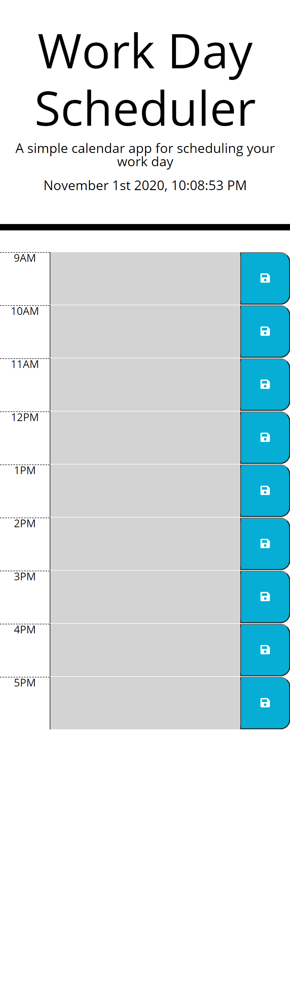
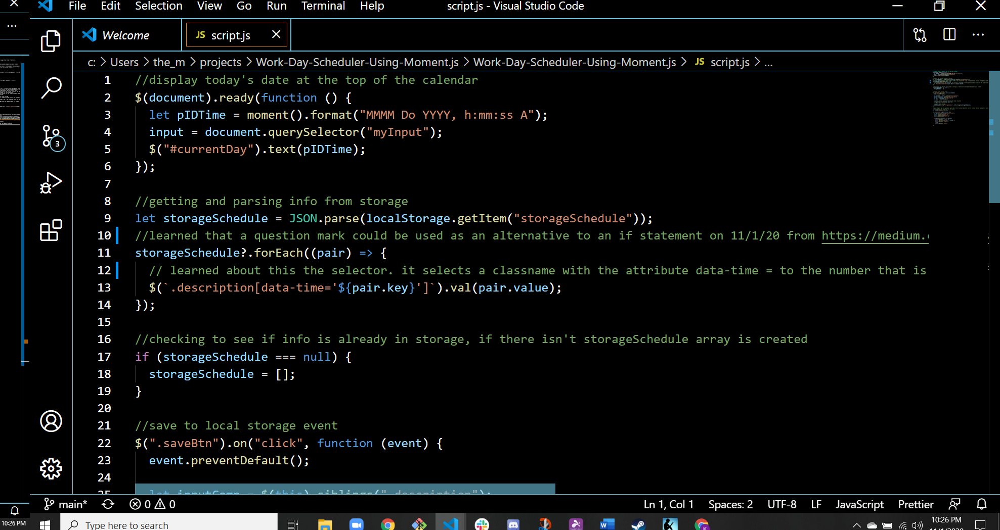

# Work Day Scheduler Using Moment.js

## Overview

The client expressed needs for a work day scheduler that allows them to manage their time effectively.

## Client's Needs/Expectations

The client, an employee with a busy schedule, established that the following needs/expecations must be met:

- The calendar application must allow the employee to save events for each hour of the standard business day (9:00 AM - 5:00 PM).
- The app will run in the browswer and feature dynamically updated HTML and CSS powered by JQeury.
- Moment.js library is to be used to work with date and time.

## Updates and Exepctations Obtained from employee with a busy schedule

Through information and feedback provided by the empoloyee with a busy schedule, the following update criteria were established:

- The employee is using a daily planner to create a schedule.
- When the employee opens the planner :
  - The current day is displayed at the to pof the calendar.
    - When the employee is scrolls down:
    - They are presented with time blocks for standard business hours.
      - When they view the time block for that day.
      - Then each time block is color-coded to indicate whether it is in the past, present, or future.
      - When the the employee clicks into a time block:
      - Then the text for that event is saved in local storage.
- When they employee refreshed the page.
- Then the saved events persist.

## Overall Deployment of Work Day Scheduler

- The \$(document).ready(function) is employed so the the JQuery events won't fire until their designated times.
- On load of page: The current formatted date and time is displayed on the top of the page using a moment().format().
- Also on load of page, if the (storageSchedule === null), then the storageSchedule open array will begin.
- A .each loop is used to dynamically add and remove .past, .present. .and future CSS styling colors to the calendar. The integer at the data-time is parsed and is compared to moment.().hours to render color coding for time comparison.
- When the busy employee inputs text into the text box and clicks the save button for the respective hour, event listeners are triggered for:
  - The information inputed into the text box and which text box was selected.
  - Which save button for its corresponding hour was pressed.
  - The scheduled event is set into local storage and then retrieved into local storage.
- If the employee refreshes the page, the saved event(s) persist in their respective time blocks, due to the retrieval of info from local storage.
  - The employee's scheduled events are generated into an array designating a key - the scheduled event and value = which hour's save button was pressed.
  - Since the employees' scheduled events are generated from inputs, JSON.parse and JSON.strigify are used to set and retrieve the scheduled event from the client side local storage.

## Deployed Optimized Website and Final JQuery Code

\*[Deployed website](https://kay0s.github.io/Work-Day-Scheduler-Using-Moment.js/) \*[GitHub Repository](https://github.com/Kay0s/Work-Day-Scheduler-Using-Moment.js/)

## Research Resources

- [jQuery.com - .each()](https://api.jquery.com/each/)
- [net-informations.com - jQuery parent(), children() and sibling ()](http://net-informations.com/jq/iq/parent.htm)
- [jQuery.com - jQuery Quick API Reference](https://oscarotero.com/jquery/)
- [jQuery.com - Attribute Equals Selector [name="value"]](https://api.jquery.com/attribute-equals-selector/)
- [MDN web docs - Conditional (ternary) operator](<https://developer.mozilla.org/en-US/docs/Web/JavaScript/Reference/Operators/Conditional_Operator#:~:text=The%20conditional%20(ternary)%20operator%20is,if%20the%20condition%20is%20falsy.>)
- [Medium - What does the ? question mark mean in JavaScript code?](https://medium.com/javascript-in-plain-english/what-does-the-question-mark-mean-in-javascript-code-353cfadcf760)
- [MDN web docs - flex](https://developer.mozilla.org/en-US/docs/Web/CSS/flex)

© 2020 Kristina Hamilton and Trilogy Education Services, a 2U, Inc. brand. All Rights Reserved.
